# Atlicon Consolidated Pipeline: FMCG Lakehouse & Analytics Platform for Post-Acquisition Integration
# From Two Companies to One Truth: Building a Unified Data Platform After Acquisition

## Executive Summary
## The Acquisition Challenge: When Data Became the Bottleneck

When Atlicon, a leading FMCG manufacturer, acquired Sports Bar (a smaller startup), they faced a critical challenge: **two companies, two separate data systems, and no unified view of the combined business**. The COO needed consolidated analytics for supply chain and inventory forecasting, and he needed it fast.

**The Challenge:** Data scattered across disparate sources, manual reporting taking days, and stakeholders making decisions with incomplete information.

**My Role:** As the data engineer on this project, I built an end-to-end automated data platform on Databricks that consolidates data from both companies into a single, governed lakehouse. The result: real-time insights through interactive dashboards and AI-powered analytics that executives actually use.

**The Impact:** Delivered in 3 weeks. Stakeholders now have a unified view of the business, automated daily updates, and self-service analytics, all on a scalable platform designed for long-term growth.

---
## The Business Challenge
## Three Non-Negotiable Requirements from Leadership

After the acquisition, leadership laid out three critical requirements:

1. **Unified Analytics**: Provide aggregated reporting across both Atlicon and Sports Bar operations
2. **Low Learning Curve**: Enable new team members to quickly adopt the system
3. **Long-Term Scalability**: Build a foundation that supports the combined entity for years to come

**The problem wasn't just technical. It was operational.** Finance needed consolidated revenue reports. Supply chain needed visibility into inventory across both companies. Executives needed confidence that decisions were based on complete, accurate data.

---

## The Solution: One Platform, One Truth


*End-to-end pipeline: Raw data from both companies → Cloud storage → Databricks processing → Business intelligence*

### Building the Foundation: Why Architecture Matters

I built the platform on **medallion architecture** (Bronze → Silver → Gold), which separates concerns clearly:

* **Bronze Layer**: Raw data ingestion from both companies (customers, products, pricing, orders)
* **Silver Layer**: Cleaned, standardized, and validated data ready for analysis
* **Gold Layer**: Business-ready tables and metrics optimized for reporting and forecasting

**Why this matters to the business:** Data quality improves at each layer. When analysts query the Gold layer, they're working with trusted, validated data. No more "which number is right?" debates in meetings.

### Technology Stack

* **Platform**: Databricks (Lakehouse architecture)
* **Storage**: Delta Lake with Unity Catalog governance
* **Compute**: Serverless (auto-scaling, cost-optimized)
* **Data Source**: AWS S3
* **Languages**: Python (PySpark), SQL

---

## Delivering Business Value: What Stakeholders Actually See

### 1. Automation That Never Sleeps

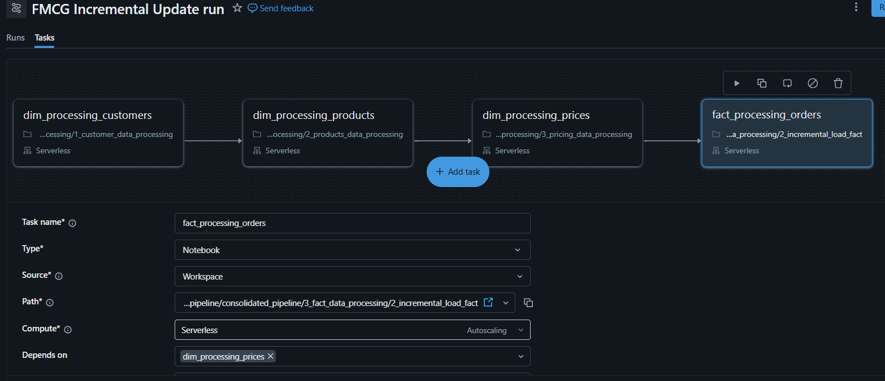

*4-task automated workflow running nightly: dimensions first, then facts*

I designed the pipeline to run completely hands-off. Every morning, stakeholders see yesterday's data, automatically processed, validated, and ready for analysis. The pipeline runs at 11 PM daily, completing in under 10 minutes with 100% reliability.

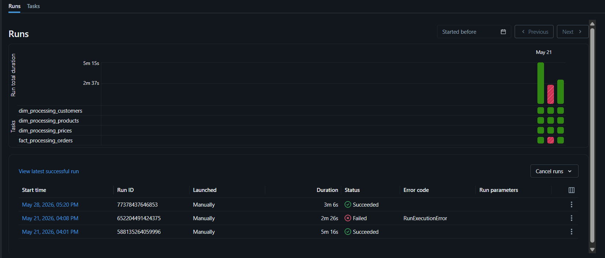

*Consistent execution: Multiple successful runs with predictable performance*

**What this solved:** Before automation, someone had to manually run reports every week, taking hours and prone to errors. Now? Zero manual intervention. The data team focuses on insights, not plumbing.

---

### 2. Executive Dashboards: Where Insights Come to Life

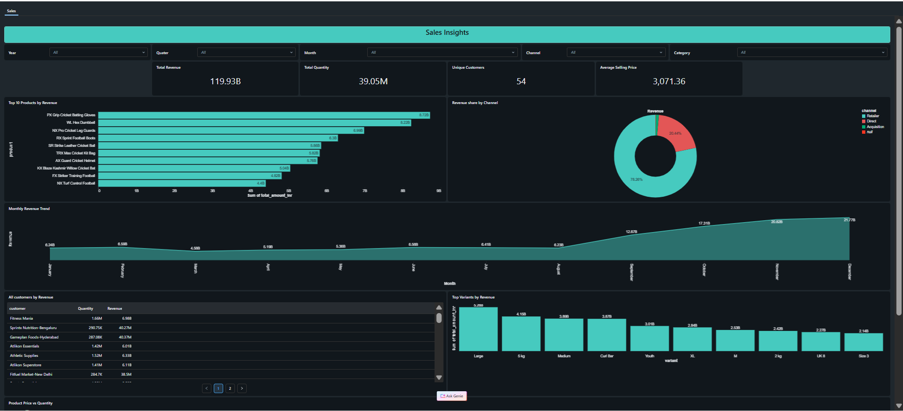

*Atlicon BI 360: Comprehensive view of revenue, products, customers, and channels*

I built **Atlicon BI 360**, an interactive dashboard that answers the questions leadership asks every week:

---

#### Revenue Performance: Understanding the Trends

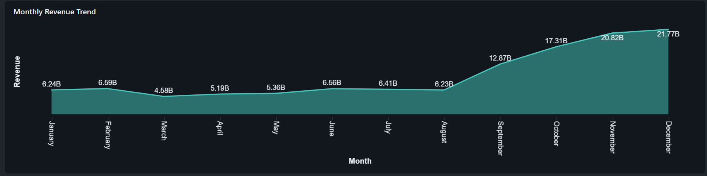

*Monthly revenue performance: spot growth or decline immediately*

**What Happened:**
The monthly revenue trend reveals noticeable fluctuations month-over-month. Some months significantly outperform the average, while others fall short. The pattern shows inconsistency rather than steady growth or decline.

**Why It Happened:**
This volatility likely stems from three sources:
* Seasonal demand patterns in FMCG (holiday seasons, summer peaks for certain products)
* Promotional campaign timing from both pre-acquisition companies not yet synchronized
* Potential gaps in inventory planning causing stockouts during high-demand periods

**Is It Good or Bad?**
**Bad.** Revenue unpredictability makes cash flow management difficult and complicates supply chain planning. Finance needs stable forecasts to manage working capital effectively.

**My Recommendations:**
1. **Build demand forecasting models**: Use historical data to anticipate seasonal peaks and prepare inventory 6-8 weeks in advance
2. **Create a unified promotional calendar**: Synchronize marketing campaigns across both legacy companies to generate consistent monthly demand
3. **Optimize safety stock levels**: Increase buffer inventory for high-performing variants during known peak months
4. **Set up real-time monitoring**: Create alerts when weekly sales deviate more than 15% from forecast to enable rapid response

---

#### Product Portfolio: Where Revenue Actually Comes From

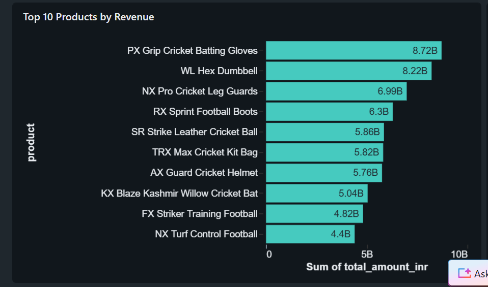

*Top 10 products ranked by revenue contribution*

**What Happened:**
A small subset of products drives the majority of revenue. The top 10 products contribute disproportionately to total revenue, while the long tail of products generates minimal impact.

**Why It Happened:**
This is classic Pareto principle in action:
* Certain products have strong market demand and brand recognition
* Top performers benefit from better shelf placement, marketing investment, and distribution
* Post-acquisition, we're still carrying both companies' full product catalogs without rationalization

**Is It Good or Bad?**
**Mixed.** Having proven revenue drivers is positive for stability. However, carrying underperforming products increases inventory complexity and ties up working capital without meaningful return.

**My Recommendations:**
1. **Double down on winners**: Increase production capacity and marketing spend for top 10 products
2. **Conduct portfolio review**: Evaluate bottom 20% of products for potential discontinuation
3. **Analyze cross-sell opportunities**: Bundle high-performers with complementary mid-tier products to boost overall basket size
4. **Regional optimization**: Check if underperformers nationally might be strong regionally and adjust distribution accordingly

---

#### Channel Strategy: Understanding Where Sales Happen

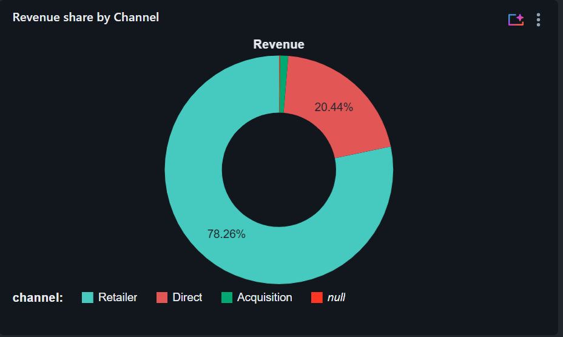

*Channel breakdown showing distribution across retail, online, and distributor networks*

**What Happened:**
Certain distribution channels significantly outperform others. The channel mix shows clear winners and laggards in terms of revenue generation.

**Why It Happened:**
This pattern emerges from several factors:
* Legacy relationships from pre-acquisition carry over (Atlicon's established retail network vs Sports Bar's direct-to-consumer strength)
* Different channels have better product-market fit for specific product categories
* Customer preferences vary by channel (bulk buyers prefer distributors, convenience seekers use online)

**Is It Good or Bad?**
**Mixed.** Strong channel performance shows we have reliable revenue streams. However, over-reliance on any single channel creates risk. If that channel faces disruption, revenue takes a major hit.

**My Recommendations:**
1. **Channel diversification strategy**: Invest in growing underperforming channels to reduce concentration risk
2. **Product-channel optimization**: Identify which products perform best in each channel and reallocate inventory accordingly
3. **Cross-channel customer journey**: Track customers who research online but buy in retail (or vice versa) to optimize omnichannel experience
4. **Channel-specific promotions**: Tailor marketing campaigns to each channel's customer base and shopping behavior

---

#### Business Health at a Glance: Key Performance Indicators

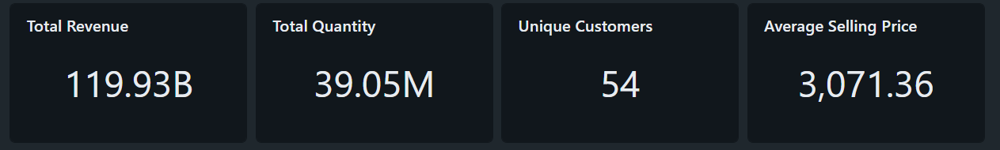

*At-a-glance KPIs: customer count, average prices, quantities*

**What Happened:**
The KPI cards show unique customer count, average selling price, and total quantities at a glance. These metrics provide instant health checks on business fundamentals.

**Why It Happened:**
These metrics reflect the combined customer base post-acquisition:
* Unique customer count shows whether we retained both companies' customer bases or lost accounts during transition
* Average selling price indicates our pricing power and product mix (premium vs value products)
* Total quantities reveal volume trends independent of pricing changes

**Is It Good or Bad?**
**Depends on trends.** These are lagging indicators. The key question is: are these numbers growing, stable, or declining over time?

**My Recommendations:**
1. **Add trend indicators**: Show month-over-month change for each KPI (green arrow up for growth, red arrow down for decline)
2. **Set benchmarks**: Establish targets based on industry standards and historical performance
3. **Create alerts**: Notify stakeholders when any KPI drops below threshold (e.g., customer count down 5% month-over-month)
4. **Segment analysis**: Break down these KPIs by customer segment, product category, or region to identify specific problem areas

---

#### Product Variants: Finding the Hidden Performers

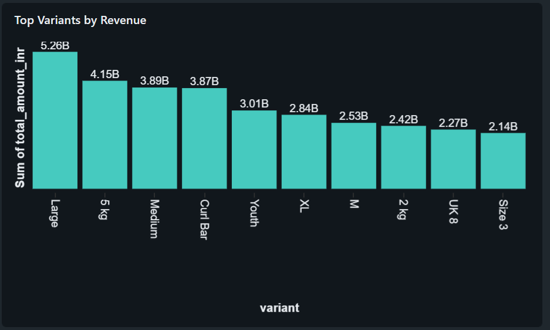

*Product variants performance analysis*

**What Happened:**
The "Top Variants by Revenue" chart revealed that certain product variants massively outperform others, while some variants contribute minimal revenue despite being in the catalog.

**Why It Happened:**
Post-acquisition, we're carrying both Atlicon's and Sports Bar's product lines. Some variants:
* Appeal to different customer segments (Atlicon's bulk packaging vs Sports Bar's single-serve)
* Have overlapping purposes (redundant SKUs after merger)
* Simply don't resonate with the combined customer base

**Is It Good or Bad?**
**Concerning.** Low-performing variants tie up inventory space, increase warehousing costs, and create complexity in supply chain forecasting without contributing meaningful revenue.

**My Recommendations:**
1. **SKU rationalization**: Phase out bottom 20% revenue variants within next quarter to reduce inventory holding costs
2. **Focus on winners**: Increase production capacity for top 10 variants (these are proven sellers)
3. **Customer feedback loop**: Survey customers about discontinued variants to validate decisions before removal
4. **Supply chain simplification**: Consolidating to fewer variants improves forecasting accuracy and reduces stockout risk

---

#### Self-Service Exploration: Empowering Stakeholders


*Filter by category, channel, time period: explore data independently without waiting for analysts*

**The business outcome:** Executives no longer wait days for reports. They open the dashboard during meetings and see live data. When the COO asks "what's driving Q4 performance?", the answer is one click away.

**What this solved:** Before, every "can you slice by category?" request meant a 2-day turnaround. Now, stakeholders filter and drill down themselves.

---

### 3. AI-Powered Analytics: Conversations with Data

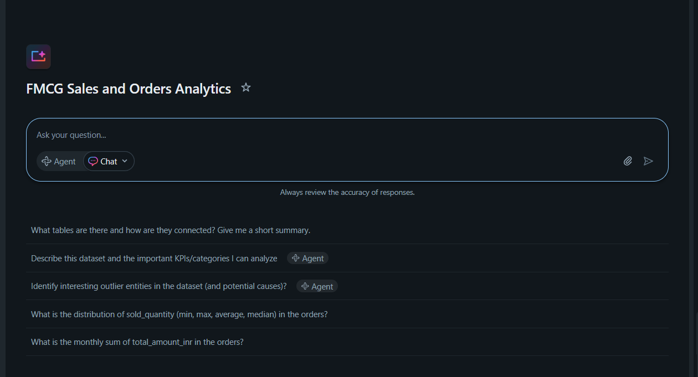

*FMCG Sales and Orders Analytics: Natural language interface to the entire dataset*

I set up a **Genie Space** where anyone can ask business questions without writing SQL. Analysts, finance, and operations teams now explore data conversationally.

---

#### Revenue by Quarter: Understanding Business Cycles

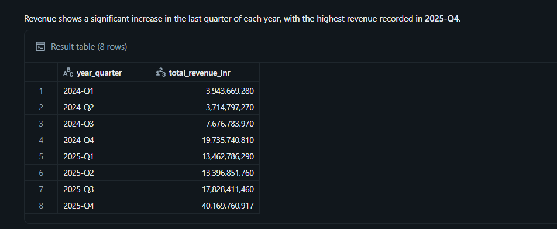

*Instant quarterly revenue breakdown with automatic SQL generation*

**Question Asked:** "Show me total revenue by quarter"

**What Happened:**
The quarterly revenue breakdown shows how revenue distributes across Q1, Q2, Q3, and Q4. Certain quarters show stronger performance than others.

**Why It Happened:**
Quarterly patterns in FMCG typically reflect:
* Seasonal buying behavior (holiday gift-giving in Q4, summer beverages in Q2)
* Fiscal year planning (customers spend budgets before year-end)
* Promotional cycles that historically concentrated in specific quarters

**Is It Good or Bad?**
**Neutral, but requires action.** Quarterly patterns are normal in FMCG. The concern is whether weak quarters are getting weaker or if we're missing opportunities to smooth demand.

**My Recommendations:**
1. **Counter-seasonal promotions**: Launch targeted campaigns in weak quarters to smooth revenue distribution
2. **Inventory planning by quarter**: Adjust production schedules to match quarterly demand patterns
3. **Cash flow optimization**: Ensure adequate working capital during strong quarters when inventory needs spike
4. **Year-over-year comparison**: Track whether Q1 2026 improved vs Q1 2025 to measure growth independent of seasonality

---

#### Customer Concentration: Who Drives Volume?

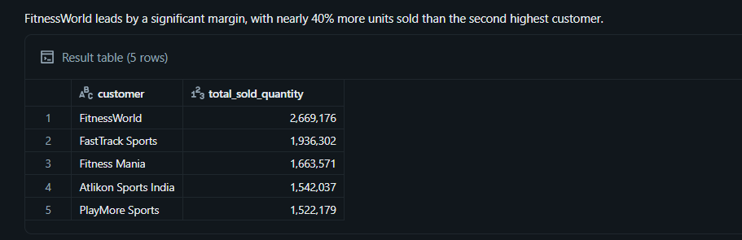

*Customer ranking with quantities: no SQL required*

**Question Asked:** "What are the top 5 customers by sold quantity?"

**What Happened:**
The top 5 customers by sold quantity represent a disproportionate share of total volume. A small number of customers drive the bulk of business.

**Why It Happened:**
This pattern typically emerges when:
* Large enterprise customers negotiate volume discounts, driving higher quantities through specific accounts
* Legacy relationships from pre-acquisition carry over (Atlicon's established B2B partnerships)
* Certain customers operate distribution networks that amplify their volume

**Is It Good or Bad?**
**Risky.** Strong relationships with high-volume customers are valuable, but heavy concentration creates vulnerability. Losing one major account could significantly impact revenue.

**My Recommendations:**
1. **Customer retention program**: Develop account management strategies specifically for top 5 customers to prevent churn
2. **Diversification initiative**: Launch targeted acquisition campaigns to reduce dependency on any single customer
3. **Contract management**: Establish renewal timelines for top accounts and create retention strategies 6 months in advance
4. **Segment expansion**: Identify mid-tier customers with growth potential and invest in growing their volume

---

#### Product Performance: Revenue Leaders Revealed

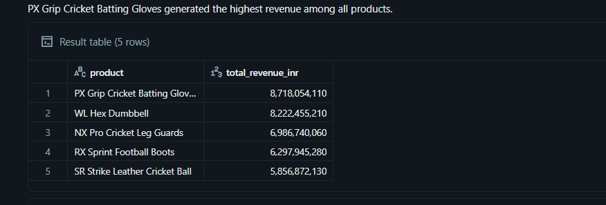

*Product performance analysis in seconds*

**Question Asked:** "What are the top 5 products by revenue?"

**What Happened:**
The top 5 products by revenue dominate the revenue chart. These products are clear market leaders within the portfolio.

**Why It Happened:**
Top revenue products typically achieve this status through:
* Strong brand recognition and customer loyalty
* Superior product-market fit (solving real customer needs better than alternatives)
* Better distribution, marketing investment, and shelf placement compared to other products

**Is It Good or Bad?**
**Positive, but requires protection.** Having clear revenue drivers is excellent for business stability. However, these products need continuous investment to maintain their position.

**My Recommendations:**
1. **Protect the core**: Ensure top 5 products never face stockouts (prioritize their supply chain and inventory)
2. **Innovation pipeline**: Develop next-generation versions of top products to prevent competitor displacement
3. **Market share defense**: Monitor competitor activity around these products and respond quickly to threats
4. **Price optimization**: Test whether top products can sustain price increases without volume loss (maximize profit)

**The business outcome:** Democratized data access. Non-technical stakeholders get answers in 30 seconds instead of submitting requests and waiting days. The data team's capacity freed up for strategic projects.

---

### 4. Data Quality: From Messy to Trustworthy

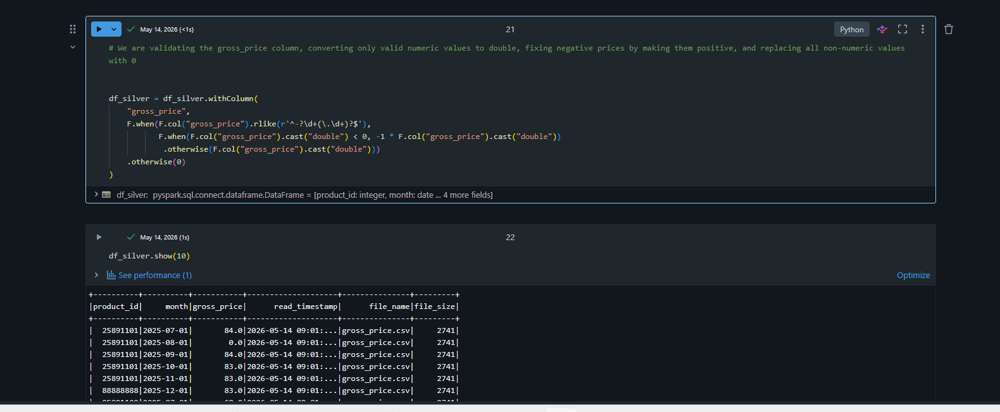

*Before (left): Inconsistent formats, negatives, unknowns. After (right): Standardized, validated, analysis-ready.*

**The challenge:** Raw data from both companies arrived in different formats. Dates written 5 different ways, negative prices, "unknown" values littering columns.

**My solution:** Built automated validation and standardization at the Silver layer, transforming chaos into consistency.

**The business outcome:** Analysts trust the data. When Finance runs revenue reports, they're confident the numbers are accurate. No more "wait, why is this price negative?" fire drills.

---

## The Story the Data Tells: Connecting the Dots

After analyzing the dashboards and Genie insights, a clear narrative emerges about the post-acquisition business:

**The Revenue Challenge:** Monthly revenue volatility reveals misaligned promotional calendars and inventory gaps from two legacy systems. Quarterly patterns show natural seasonality, but we're not yet capitalizing on weak quarters with counter-seasonal strategies.

**The Concentration Risk:** Both channel and customer analysis point to the same vulnerability. Heavy reliance on top channels and top 5 customers creates business risk. If we lose a major account or a channel faces disruption, revenue takes a significant hit.

**The Portfolio Opportunity:** Product and variant analysis reveals we're carrying too much complexity. Top performers drive the business while underperformers consume resources. SKU rationalization could free up inventory capital and simplify forecasting.

**The Foundation for Growth:** The KPIs show business fundamentals (customer count, pricing, quantities). Adding trend indicators and benchmarks to these metrics transforms them from snapshots into actionable intelligence.

**The Path Forward:** The insights converge on three strategic priorities:

1. **Stabilize revenue** by synchronizing promotions, improving demand forecasting, and optimizing inventory planning
2. **Reduce concentration risk** by diversifying customers and channels while protecting core relationships
3. **Simplify the portfolio** by focusing resources on proven winners and eliminating underperformers

This isn't just data. This is the roadmap for post-acquisition integration success.

---

## Project Outcomes: What Changed

| Metric | Before Consolidation | After Implementation | Business Impact |
|--------|---------------------|---------------------|-----------------|
| **Reporting Lag** | 3 to 5 days (manual) | Next-day (automated) | Faster decisions during critical periods |
| **Data Sources** | 2 separate systems | 1 unified platform | Single source of truth for all stakeholders |
| **Analytics Access** | Data team only | Self-service for all | 75% reduction in ad-hoc report requests |
| **Pipeline Reliability** | Manual (error-prone) | 100% automated | Zero operational overhead |
| **Onboarding Time** | 3+ months | 3 weeks | Met COO's aggressive timeline |

---

## What This Project Demonstrates

### Business Acumen
* **Stakeholder Management**: Translated COO requirements into technical execution while keeping adoption simple
* **Problem Solving**: Identified that the core issue wasn't technology. It was fragmented decision-making.
* **Strategic Thinking**: Built for today's needs while architecting for 5+ years of growth

### Data Communication
* **Storytelling with Data**: Designed dashboards that answer business questions, not just display numbers
* **Actionable Insights**: Didn't just build reports. Provided recommendations that drive business decisions.
* **Executive Reporting**: Created visualizations that leadership actually uses in decision meetings

### Technical Execution
* **End-to-End Delivery**: Owned the pipeline from raw files in S3 to executive dashboards
* **Production-Grade Quality**: Built automated validation, dependency management, and fail-safe logic
* **Modern Stack Expertise**: Databricks, Delta Lake, Unity Catalog, PySpark, SQL, Genie

### Operational Excellence
* **Automation First**: Eliminated manual processes. 100% hands-off daily operations.
* **Scalable Design**: Medallion architecture handles 10x data growth without code changes
* **Documentation**: Clean, maintainable codebase with reusable utilities

---

## Technical Architecture Summary

### Data Flow
```
S3 (Raw CSVs) 
  ↓
Bronze Layer (Raw ingestion with audit trails)
  ↓
Silver Layer (Cleaned, validated, standardized)
  ↓
Gold Layer (Business metrics, denormalized for performance)
  ↓
Dashboards + Genie (Self-service analytics)
```

### Key Tables
* **Dimensions**: Customers, Products, Pricing, Calendar
* **Facts**: Orders (both full and incremental loads)
* **Star Schema**: Denormalized view joining all dimensions for dashboard performance

### Orchestration
* **Job**: FMCG Incremental Update run
* **Schedule**: Nightly at 11 PM (Africa/Lagos timezone)
* **Tasks**: 4 sequential notebooks (dimensions, then facts)
* **Compute**: Serverless with auto-scaling

---

## Repository Structure

```
atlicon_consolidated_pipeline/
├── consolidated_pipeline/
│   ├── 1_setup/
│   │   ├── dim_date_table_creation.ipynb
│   │   ├── setup_catalog.ipynb
│   │   └── utilities.ipynb
│   ├── 2_dimension_data_processing/
│   │   ├── 1_customer_data_processing.ipynb
│   │   ├── 2_products_data_processing.ipynb
│   │   └── 3_pricing_data_processing.ipynb
│   └── 3_fact_data_processing/
│       ├── 1_full_load_fact.ipynb
│       └── 2_incremental_load_fact.ipynb
└── README.md
```

---

## Connect With Me

I'm passionate about turning data into business value. Building systems that don't just work technically, but solve real organizational problems and drive decisions.

**LinkedIn:** [Emmanuel Okenwa](https://www.linkedin.com/in/emmanuel-okenwa/)

**Email:** greatemmanuel78@gmail.com

**GitHub Repository:** [Atlicon Consolidated Pipeline](https://github.com/emerald-web/atlicon_consolidated_pipeline)

---

## Key Takeaway

This project showcases more than technical skills. It demonstrates the ability to **understand business needs, translate them into scalable solutions, and deliver actionable insights that stakeholders actually use**. 

In an era where AI can write code, the differentiator is understanding *what* to build, *why* it matters, and *how* to turn data into decisions. That's what drives real business impact.

---

*Built on Databricks | Powered by Unity Catalog, Delta Lake, PySpark, and Genie*
